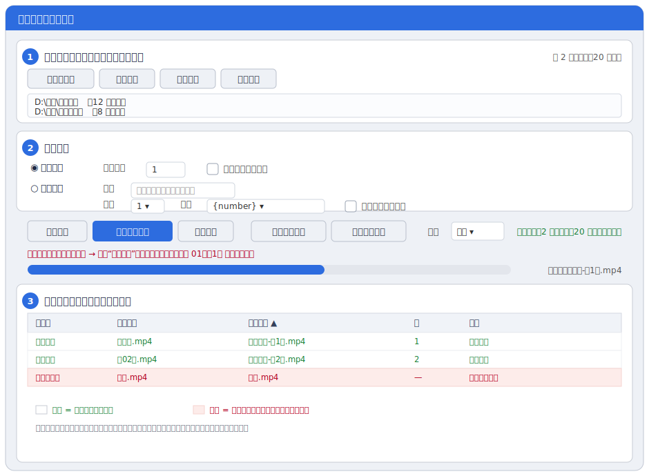

# 视频批量重命名工具

[](https://github.com/wudiazui/video-batch-renamer/releases)
[](https://github.com/wudiazui/video-batch-renamer/actions/workflows/tests.yml)
[](LICENSE)


一个 Windows 桌面小工具，**批量给短剧 / 课程等视频按编号或集数改名**——递归扫描文件夹里的视频，移动到根目录后重命名。改名前先预览、确认无误才执行，每次执行留日志、可一键撤销。



## 下载使用

**普通用户**：到 [Releases](https://github.com/wudiazui/video-batch-renamer/releases) 下载 `视频批量重命名工具-vX.Y.Z.exe`，双击即可运行，**无需安装 Python**。

详细图文教程见 [使用手册.md](使用手册.md)。

## 功能特性

- 🎬 **两种改名模式**：连续编号（`1.mp4、2.mp4…`）/ 识别集数（`第1集 / 01 / 第十一集` → `第1集.mp4` 或 `剧名-第1集.mp4`）。
- 🗂 **多文件夹**：一次处理多个文件夹；可勾选「跨文件夹连续编号」让编号接续。
- 👀 **先预览再执行**：确认没有红色错误才能执行；改了设置预览自动失效。
- ↩️ **可撤销**：每次执行在各文件夹生成 CSV 日志，支持撤销最近一次或指定日志。
- 🛡 **安全**：不覆盖已有文件，不删非视频文件，只清理移走视频后变空的子文件夹；拦截非法字符与 Windows 保留名。
- 🍼 **新手友好**：实时「改名后示例」、全控件悬停说明、两步走引导、高级选项默认折叠。
- 📐 **自适应界面**：整窗滚动、随窗口大小回流，小屏也不截断。

## 快速上手

1. **添加文件夹**（可多个）。
2. 选 **命名模式**（连续编号 / 识别集数），看「改名后示例」确认效果。
3. 点 **生成预览**，确认没有红色错误。
4. 点 **确认执行改名**。改错了用「撤销」。

支持的视频格式：`.mp4 .mov .mkv .avi .wmv .flv .webm .m4v .ts`。

## 命名模板

| 模板 | 模式 | 输出示例 |
|------|------|----------|
| `{number}` | 连续编号 | `1.mp4` |
| `EP{number}` | 连续编号（补零 2） | `EP01.mp4` |
| `第{episode}集` | 识别集数 | `第1集.mp4` |
| `{title}-第{episode}集` | 识别集数 | `庆余年-第1集.mp4` |

## 源码运行 / 开发

无第三方依赖（仅 Python 3.10+ 标准库，含 tkinter）。

```powershell
python src\main.py            # 运行（也可双击 run.bat）
python -m unittest discover -s tests   # 运行测试
```

打包 EXE（需先 `pip install pyinstaller`）：

```powershell
powershell -ExecutionPolicy Bypass -File .\build_exe.ps1
```

产物输出到 `release\视频批量重命名工具-vX.Y.Z.exe`。

## 配置和日志

- 历史配置（文件夹列表、命名设置、窗口大小）保存到 `%APPDATA%\VideoRenamerGUI\settings.json`。
- 重命名日志保存到每个被处理目录下的 `_rename_logs`。

## 许可证

[MIT](LICENSE) © 2026 wudiazui
